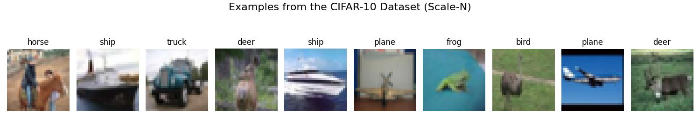
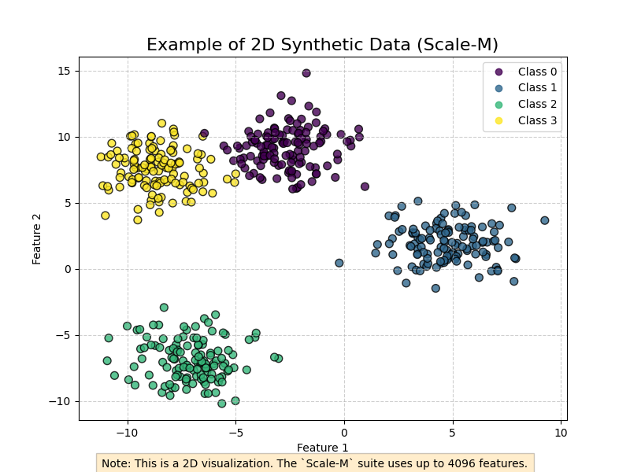
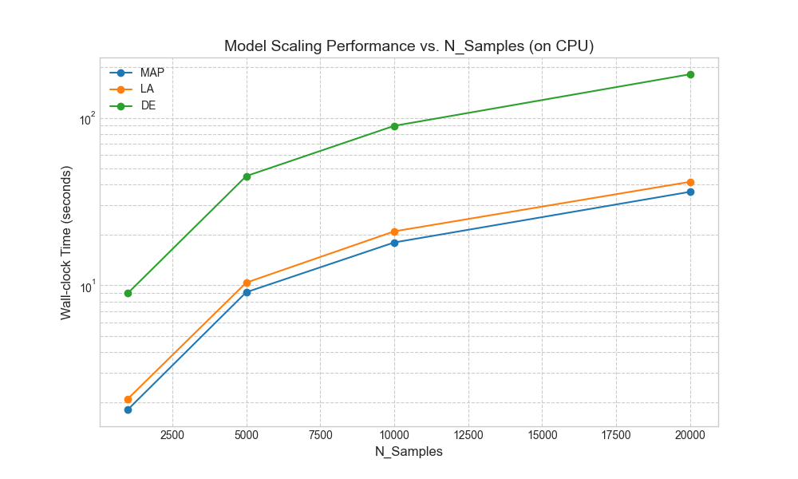
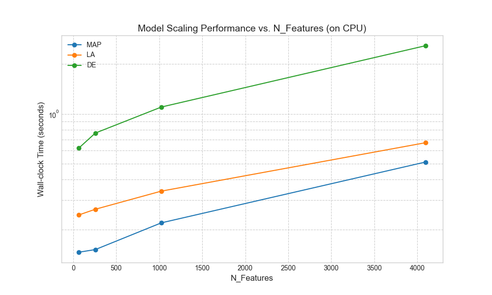

# Putting "Effortless" AI to the Test: A Control Dataset for Measuring Computational Cost

### Denis Krylov (6277470)

In Bayesian Deep Learning models that are not only accurate but also robust and aware of their own uncertainty. However, these methods have historically been saddled with a reputation for being computationally prohibitive. A recent paper, **["Laplace Redux – Effortless Bayesian Deep Learning"](https://arxiv.org/abs/2106.14806) by Daxberger et al. (2021)**, directly challenges this assumption. 

**Hypothesis: a classic method, the Laplace Approximation (LA), can provide the benefits of Bayesian inference while "excelling in terms of computational cost" compared to popular, heavier alternatives like Deep Ensembles.**

This property of being "effortless" or computationally efficient is a critical one. If true, it would make powerful Bayesian techniques accessible to a much wider audience. But how do we scientifically test such a claim? Standard benchmarks like ImageNet or GLUE are designed to measure predictive performance, not scalability. To properly validate this hypothesis, we need a toy dataset.

## A Control Dataset for Cost

To precisely test the property of computational efficiency, I developed a control dataset designed to isolate and measure how a model's performance scales along two critical axes of complexity: data size and feature dimensionality.

### 1. Scaling with Data Size (`Scale-N`)

- **Motivation:** How does a model's training time react as the dataset grows from a small pilot study to a "big data" scenario? An efficient method should scale gracefully.
- **Description:** This suite uses the standard CIFAR-10 dataset but provides subsets of the training data containing 1,000, 5,000, 10,000 and 20,000 samples. The task (10-class image classification) remains the same, isolating the effect of dataset size on training time.
- **Example:** Each data point is a 32x32 color image from the CIFAR-10 dataset.

### 2. Scaling with Feature Dimensionality (`Scale-M`)

- **Motivation:** In fields like natural language processing, models must handle data with thousands or even millions of features. How does a method's cost scale with the width of the input data?
- **Description:** This suite consists of synthetically generated classification tasks. I keep the number of samples fixed (at 5,000) but vary the number of input features: 64, 256, 1,024, and 4,096. The data for each of the 10 classes is drawn from a distinct Gaussian distribution, making the classification task itself easy. This ensures I am measuring the cost of handling high-dimensional inputs, not solving a difficult problem.
- **Example:** A data point is a flat vector of a given length (e.g., 4096 floating-point numbers).

### How the Dataset Was Generated

- The entire suite is generated programmatically by my experiment script, ensuring full reproducibility. For `Scale-N`, I simply use PyTorch's `Subset` utility to select the desired number of samples from the official `torchvision` CIFAR-10 dataset.

- For `Scale-M`, I use `scikit-learn`'s `make_blobs` function to generate the synthetic data, which gives us precise control over the number of samples, features, and class centers. The following snippet from our code shows how this is done:

```python
from sklearn.datasets import make_blobs
import torch
from torch.utils.data import TensorDataset

def get_scale_m_dataset(n_features, n_samples=5000, n_classes=10):
    """
    Generates synthetic data with a varying number of features.
    """
    X, y = make_blobs(
        n_samples=n_samples, 
        centers=n_classes, 
        n_features=n_features, 
        random_state=42, 
        cluster_std=2.0
    )
    
    return TensorDataset(torch.from_numpy(X).float(), torch.from_numpy(y).long())
```

## Examples of Datasets

### CIFAR-10



### Synthetic Data



## Examples of Results

### Suite N



### Suite M



## Link to Experiment Code on GitHub

https://github.com/denskrlv/laplace-toy-dataset

## References

[1] Daxberger, E., Kristiadi, A., Immer, A., Eschenhagen, R., Bauer, M., & Hennig, P. (2021). Laplace Redux – Effortless Bayesian Deep Learning. arXiv preprint arXiv:2106.14806. https://arxiv.org/abs/2106.14806